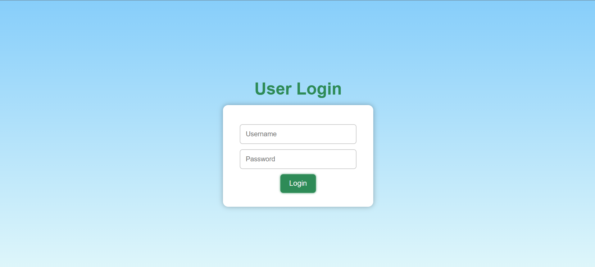
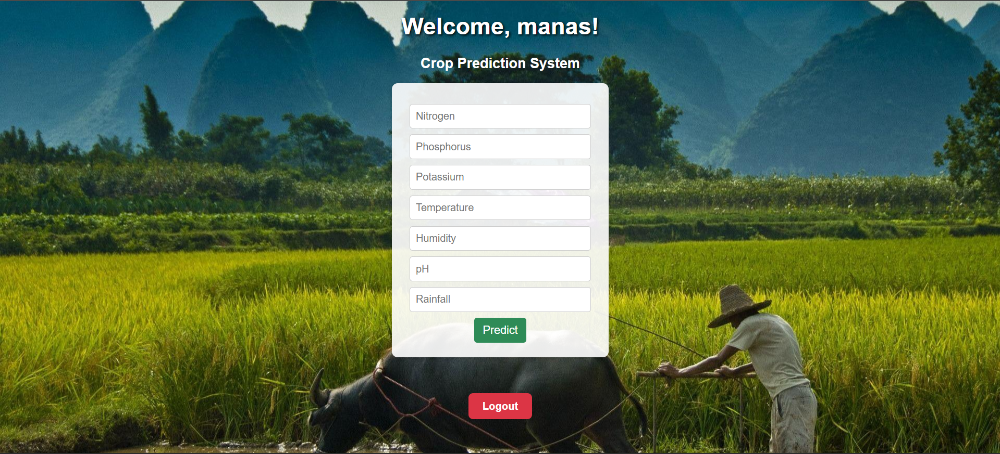

# 🌾 Crop Prediction Model using Machine Learning

Welcome to the **Crop Prediction Web App** — a Flask-powered machine learning project that predicts the most suitable crop based on various soil and climate conditions like Nitrogen, Phosphorus, Potassium (NPK), temperature, humidity, pH, and rainfall.

---  
    
## 🧠 Features     

- 🔐 Simple login system    
- 🧾 Easy-to-use input form
- 📈 Machine learning model (Random Forest Classifier)
- 🎨 Clean and responsive UI (HTML + CSS)
- 📊 Real-time crop predictions based on input data

---

## 🛠️ Tech Stack

- **Frontend:** HTML, CSS
- **Backend:** Python, Flask
- **Machine Learning:** Scikit-learn
- **Libraries:** Pandas, NumPy
- **Dataset:** Crop Recommendation Dataset from Kaggle

---

## 📂 Project Structure

CropPredictionModel/
├── static/ # CSS & Images
│ ├── index.css
│ ├── farmers.png
│ ├── login-page.png
│ └── home-page.png
├── templates/ # HTML Templates
│ ├── index.html
│ └── login.html
├── main.py # Flask application
├── crop_prediction_model.py # ML model script
├── Crop_recommendation.csv # Dataset
├── requirements.txt # Python dependencies
└── README.md # Project description

---

## 🖼️ Screenshots

### 🔐 Login Page

### 🏡 Home Page

---

## 📦 Installation & Usage

### 🔧 1. Clone the Repository

git clone https://github.com/manasranjanjena68/CropPredictionModel.git
cd CropPredictionModel

### 📦 2. Install Requirements

pip install -r requirements.txt

### 🚀 3. Run the Application

python main.py

### 🌐 4. Open in Browser

Visit:

http://127.0.0.1:5000/

## 🧪 Example Input
N     P     K     Temperature     Humidity     pH     Rainfall
90    42    43    20.8°C          82.0%        6.5    202.9 mm

→ Predicted Crop: rice

📚 Dataset Reference
Public dataset from Kaggle - Crop Recommendation

🙌 Author
👨‍💻 Manas Ranjan Jena
🔗 GitHub | LinkedIn
📧 manasranjanjena68@gmail.com

 
🌟 Support
If you found this project helpful, please ⭐ star the repo to support my work.

---

### 📌 What You Should Do:
1. ✅ Add both screenshots in `static/` folder:
   - `farmers.png` (Login)
   - `home.png` or any relevant image for prediction page

2. ✅ Push this updated `README.md` to your GitHub repo.

3. ❌ Skip hosting-related parts for now (since not deployed).

4. ✅ Once deployed (Render, Vercel, or any), I’ll help you add the **Live Preview** section.

---

